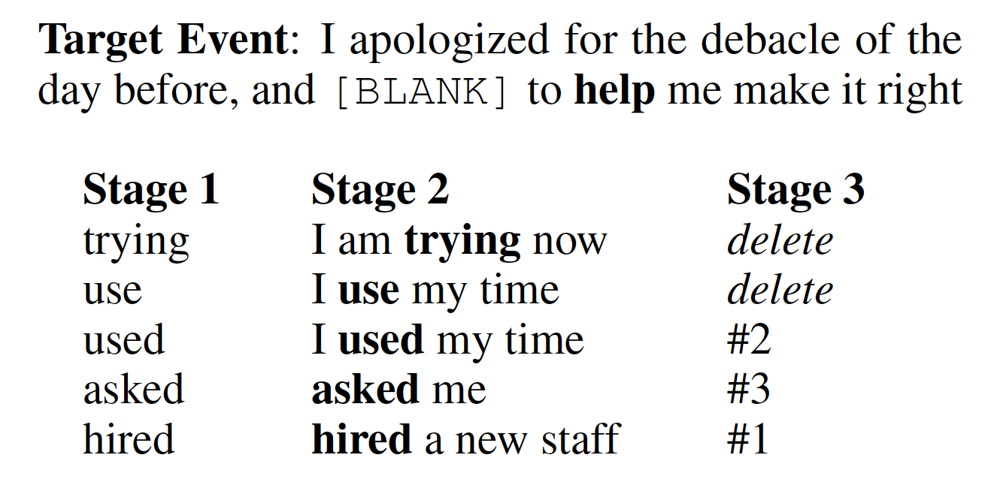
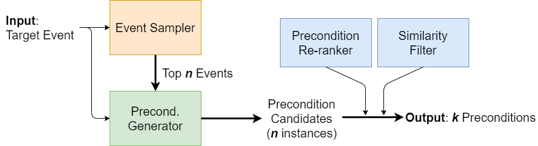

# DiP: Diverse Precondition Generation System

## Overview

DiP(**Di**verse **P**recondition) is a generation system introduced in our paper "_Toward Diverse Precondition Generation_" at \*Sem 2021 

Preprint will be available soon.

## DiP: Diverse Precondition Generation
We introduce a three-stage generative process, which we call DiP. In the first stage, DiP uses an event sampler whose only goal is to generate event trigger words as precondition candidates. In the second stage, DiP forces the generative model to use the candidate triggers from the first stage to produce the full description of the precondition event. In the third stage, DiP reranks and filters the generated descriptions using a precondition classifier (also trained from the same training data).

Here's a brief example:

## Download
- The dataset can be downloaded from [here](https://drive.google.com/file/d/1NTIvw_pGVfkndP0_rB1kqWew03oH0Lo0/view?usp=sharing)
- The models can be downloaded from [here](https://drive.google.com/file/d/1pxIGoDGy0Vealko_uc3UUE20EcBI3lg1/view?usp=sharing)

## Contributors
- [Heeyoung Kwon](https://heeyoungkwon.com) (Stony Brook University)
- [Nate Chambers](https://www.usna.edu/Users/cs/nchamber/) (US Naval Academy)
- [Niranjan Balasubramanian](https://www3.cs.stonybrook.edu/~niranjan) (Stony Brook University)
